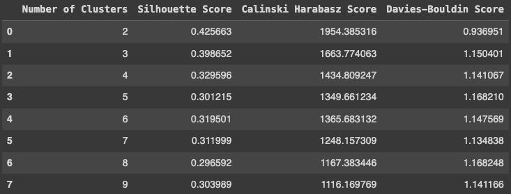

# **Customer Segmentation and Marketing Strategies Optimization**

Author: Danielle Dong

## **Project Overview**

The project aims to analyze customer data to enhance marketing strategies through effective segmentation. By leveraging machine learning techniques, I identified distinct customer profiles and tailor marketing campaigns to improve engagement and drive sales. This project utilizes clustering methods (from Scikit-Learn) to categorize customers based on their income, purchase behavior, marital status, education and response to marketing campaigns.

## **Objectives**

- Segment Customers: Identify and analyze distinct customer clusters based on income, purchasing patterns, and marketing engagement.
Optimize Marketing Strategies: Develop targeted marketing campaigns for each customer segment to increase engagement and drive sales.
- Enhance Customer Satisfaction: Tailor promotions and offers to match the preferences and behaviors of different customer groups.

## **Data and Methodology** 

- Data Sources: https://www.kaggle.com/datasets/imakash3011/customer-personality-analysis
- Preprocessing: Cleaned and prepared data by handling missing values, outliers, transforming categorical data to numerical data, drop redundant columns, reduce data dimension

## **Clustering Methods** 

- **K-Means Clustering:**

  Identified customer segments based on income levels, purchase behavior, and engagement metrics.

  Partitioned customers into distinct clusters for targeted analysis.
  

- **Hierarchical Clustering (dendogram visualisation):**
  
  Validated K-Means results and explored hierarchical relationships within the data.

  Provided insights into the nested structure of customer segments.
  

- **Silhouette, Calinski-Harabasz Index , Davies-Bouldin Index Analysis:**

  Assessed clustering quality and determined the optimal number of clusters.

  Evaluated intra-cluster similarity compared to inter-cluster similarity.
  

* **Conclusion:**
Although the elbow method initially suggested 5 clusters, the test scores, cluster distribution, and dendrogram analysis indicate that the optimal number of clusters is 3. This choice yields the highest Silhouette and Calinski-Harabasz scores, along with the lowest Davies-Bouldin score, confirming better clustering performance. 

# **Cluster Profiles**

## **Cluster 1: High Income, High Engagement**

- Characteristics: Highest income, significant purchase variability, high engagement with marketing campaigns.
- Marketing Focus: Premium products, in-store and catalog promotions.

## **Cluster 2: Moderate Income, Deal-Oriented Shoppers, Loyal Customers**

- Characteristics: Moderate income, active in online and deal-based purchases, moderate marketing engagement.
- Marketing Focus: Online deals, targeted digital campaigns.

## **Cluster 0: Low Income, Low Engagement**
- Characteristics: Lowest income, minimal purchases, low engagement with marketing campaigns.
- Marketing Focus: Family-oriented products, value-driven promotions.

# **Implementation Plan**

**Campaign Design:**

- Develop tailored marketing campaigns for each cluster based on their profiles and preferences.

**Monitoring and Evaluation:**

- Track campaign performance, customer engagement, and sales metrics.
- Assess the effectiveness of targeted marketing strategies.

**Optimization:**

Continuously refine marketing strategies based on feedback and performance data.

# **Technologies and Tools**
1. Programming Languages: Python
2. Libraries: Scikit-Learn, Pandas, NumPy, Matplotlib, Seaborn

# **Expected Outcomes**
1. Increased customer engagement through personalized marketing strategies.
2. Higher sales conversion rates by targeting high-value segments.
3. Enhanced customer satisfaction through tailored offers and promotions.

